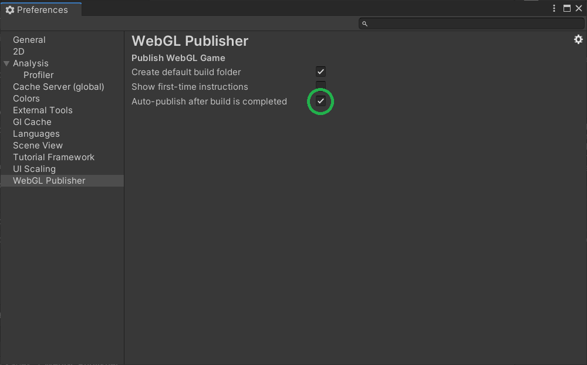

# About WebGL Publisher

Use the WebGL Publisher to build, publish, and share your WebGL project on Unity Play. You can also use the WebGL Publisher to inspect and manage WebGL builds of your project.

## Package contents

The following table describes the package folder structure:

|**Location**|**Description**|
|---|---|
|*Editor*|Contains the core scripts of the WebGL Publisher.|
|*Editor/Resources*|Contains all the images used in the UI.|
|*Plugins/System.IO.Compression.FileSystem*|Contains a compression library needed to upload builds.|
|*Tests*|Contains unit tests that ensure that quality standards are met for the package.|
|*UI*|Contains all the UXML and USS files needed for the package UI.|

## Installation

To install this package, follow the instructions in the [Package Manager documentation](https://docs.unity3d.com/Manual/upm-ui-install.html).

## Requirements

This version of WebGL Publisher is compatible with the following versions of the Unity Editor:

* 2019.3 and later

## Known Limitations
The zipped build cannot exceed 500 MB.

## Helpful links

If you are new to the WebGL Publisher or have a question after reading this documentation, you can join our [support forum](https://www.google.com/url?q=https://forum.unity.com/forums/webgl.84/&sa=D&ust=1603365406629000&usg=AOvVaw0_pjiq-B5xg1bQxrUFfSFX).

# Using WebGL Publisher
To use the WebGL Publisher, you need to install it first. This will create a new menu item called <b>Publish</b> in the top bar of the editor.

Click on <b>Publish > WebGL Project</b> to open the WebGL Publisher, and follow the on-screen instructions in order to build and publish your game.

Please note that if you are not logged in with your Unity account, you will be instructed to do so.

If you have not built the project yet, you will be instructed to do so. The <b>Build Settings</b> window will also pop up if you have not selected any scene to build.

You can now upload your project to Unity Play. If the upload succeeds, you will be directed to a page where you can edit the name and description of your project before finally publishing it.
You can then share the link of your published project so that everybody can play the build.

By default, the WebGL Publisher will automatically publish your build once it is ready. If you want to disable this behavior, select <b>Edit > Preferences > WebGL Publisher.</b>

