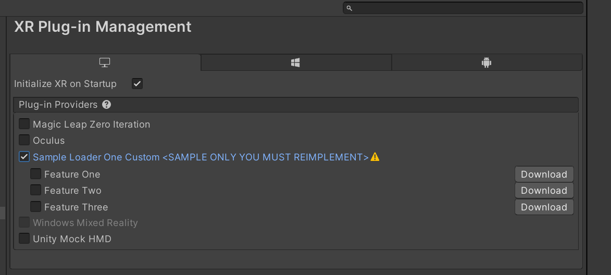
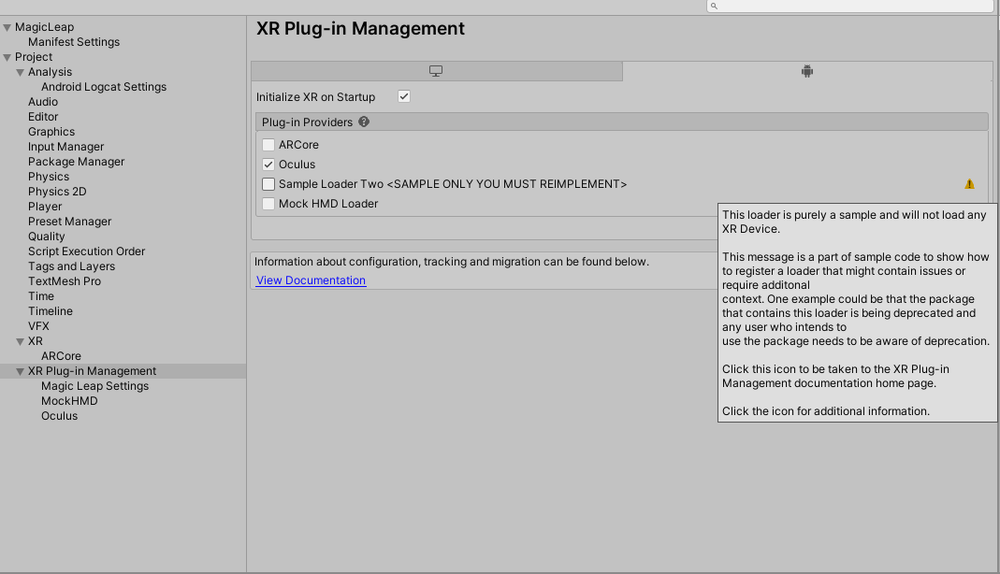

# Package author documentation

## XR Plug-in Management packages and Unity packages

All **XR Plug-in Management** packages must also be full Unity packages. The package does not have to be registered or exist in any external repository or package server. It can live within the `Assets` folder. The only requirement is that you define the package with a `package.json` file and a unique package id.

For more information, see documentation on [Unity Packages](https://docs.unity3d.com/Manual/PackagesList.html).

## Lifecycle management

This package enables you to manage the lifecycle of XR SDK subsystems without the need for boilerplate code. The `XRManagerSettings`class provides a scriptable object that your app can use to start, stop, initialize, and deinitialize a set of subsystems defined in an `XRLoader` instance.

Providers must create a subclass of `XRLoader` to make a Loader available for their particular runtime scheme.

The `XRLoader` interface looks like this:

```csharp
public abstract class XRLoader : ScriptableObject
{
    public virtual bool Initialize() { return false; }

    public virtual bool Start() { return false; }

    public virtual bool Stop() { return false; }

    public virtual bool Deinitialize() { return false; }

    public abstract T GetLoadedSubsystem<T>() where T : IntegratedSubsystem;
}
```

To handle subsystem management in a type-safe manner, derive from the `XRLoaderHelper` class. For an example, see *[Samples/SampleLoader.cs](/Samples/SampleLoader.cs)*.

An `XRLoader` is a [ScriptableObject](https://docs.unity3d.com/Manual/class-ScriptableObject.html), which means you can create one or more instances of it. Each `XRLoader` subclass defines the subsystems and their load order, and manages the set of subsystems they require.

Add all the `XRLoader` instances you created to the **Loaders** property of the **XRManagerSettings**, and arrange them in the order you want them to load. When initializing Loaders, **XR Manager Settings** calls each `XRLoader` instance it has a reference to, in the order you specify, and attempts to initialize each one. The first Loader to initialize successfully becomes the active Loader and Unity stops all further attempts to initialize other Loaders. Once that happens, you can query the static `XRManagerSettings.ActiveLoader` instance to access the active Loader. If all Loaders fail to initialize, Unity sets `activeLoader` to null.

Scene-based automatic lifecycle management hooks into the following `MonoBehaviour` callback points:

|Callback|Lifecycle step|
|---|---|
|OnEnable|Find the first Loader that initialized successfully and set `ActiveLoader`.|
|Start|Start all subsystems.|
|OnDisable|Stop all subsystems.|
|OnDestroy|Deinitialize all subsystems and remove the `ActiveLoader` instance.|

Application lifetime-based automatic lifecycle management hooks into the following callback points:

|Callback|Lifecycle step|
|---|---|
|Runtime initialization after assemblies loaded|Find the first Loader that succeeds initialization and set `ActiveLoader`.|
|Runtime initialization before splash screen displays|Start all subsystems.|
|OnDisable|Stop all subsystems.|
|OnDestroy|Deintialize all subsystems and remove the `ActiveLoader` instance.|

## Configuring build and runtime settings through Unified Settings

A provider might need additional settings to help manage build issues or runtime configuration. To do this, add an `XRConfigurationData` attribute to a ScriptableObject, and define a set of properties you want to surface to allow users to control configuration. Unity displays configuration options in the **XR** section of the **Unified Settings** window.

Unity manages the lifecycle of one instance of the class marked with the attribute through the [EditorBuildSettings](https://docs.unity3d.com/ScriptReference/EditorBuildSettings.html) config object API. If you don't provide a dedicated UI, configuration settings are displayed in the **Unified Settings** window using the standard **Scriptable Object** UI Inspector. You can create a custom **Editor** for your configuration settings type, which then replaces the standard Inspector in the **Unified Settings** window.

The provider needs to handle getting the settings from `EditorUserBuildSettings` into the built application. You can do this with a custom build processing script. If you only need to make sure that you have access to the same settings at runtime, you can derive from `XRBuildHelper<T>`. This is a generic abstract base class that takes the build settings stored in `EditorUserBuildSettings` and gets them into the built application for runtime access.

The simplest build script for your package would look like this:

```csharp
public class MyBuildProcessor : XRBuildHelper<MySettings>
{
    public override string BuildSettingsKey { get { return "MyPackageSettingsKey"; } }
}
```

You can override the build processing steps from `IPreprocessBuildWithReport` and `IPostprocessBuildWithReport`, but make sure you call to the base class implementation. If you don’t, your settings don't transfer to the built application.

```csharp
public class MyBuildProcessor : XRBuildHelper<MySettings>
{
    public override string BuildSettingsKey { get { return "MyPackageSettingsKey"; } }

    public override void OnPreprocessBuild(BuildReport report)
    {
        base.OnPreprocessBuild(report);
        // Do your work here
    }

    public override void OnPostprocessBuild(BuildReport report)
    {
        base.OnPreprocessBuild(report);
        // Do your work here
    }
}
```

If you want to support different settings per platform at build time, you can override `UnityEngine.Object SettingsForBuildTargetGroup(BuildTargetGroup buildTargetGroup)` and use the `buildTargetGroup` attribute to retrieve the appropriate platform settings. By default, this method uses the key associated with the settings instance to copy the entire settings object from `EditorUserBuildSettings` to `PlayerSettings`.

```csharp
public class MyBuildProcessor : XRBuildHelper<MySettings>
{
    public override string BuildSettingsKey { get { return "MyPackageSettingsKey"; } }

    public override UnityEngine.Object SettingsForBuildTargetGroup(BuildTargetGroup buildTargetGroup)
    {
        // Get platform specific settings and return them. Use something like the following
        // for simple settings data that isn't platform specific.
        UnityEngine.Object settingsObj = null;
        EditorBuildSettings.TryGetConfigObject(BuildSettingsKey, out settingsObj);
        if (settingsObj == null || !(settingsObj is T))
            return null;

        return settingsObj;

    }
}
```

If you need more extensive support and/or complete control, you can make a copy of the `SampleBuildProcessor` in the `Samples/Editor` folder and work from there.

## Package metadata

Your plug-in must provide metadata information for it to be usable by the **XR Plug-in Management** system. Your plug-in must implement the following interfaces:

* IXRPackage
* IXRPackageMetadata
* IXRLoaderMetadata

The system will use .Net reflection to find all types implementing the **IXRPackage** interface. It will then attempt to instantiate each one and populate the metadata store with the information provided by each instance.

You can only have one instance of **IXRPackage** within a given Unity package. The **IXRMetadata.packageId** field must return the same id as set in the package's `package.json` file.

## Example: Simple, minimal package information setup:

```csharp
    class MyPackage : IXRPackage
    {
        private class MyLoaderMetadata : IXRLoaderMetadata
        {
            public string loaderName { get; set; }
            public string loaderType { get; set; }
            public List<BuildTargetGroup> supportedBuildTargets { get; set; }
        }

        private class MyPackageMetadata : IXRPackageMetadata
        {
            public string packageName { get; set; }
            public string packageId { get; set; }
            public string settingsType { get; set; }
            public List<IXRLoaderMetadata> loaderMetadata { get; set; }
        }

        private static IXRPackageMetadata s_Metadata = new MyPackageMetadata(){
                packageName = "My XR Plug-in",
                packageId = "my.xr.package",
                settingsType = "My.Package.MyPackageSettings",
                loaderMetadata = new List<IXRLoaderMetadata>() {
                new MyLoaderMetadata() {
                        loaderName = "My Loader",
                        loaderType = "My.Package.MyLoader",
                        supportedBuildTargets = new List<BuildTargetGroup>() {
                            BuildTargetGroup.Standalone,
                            BuildTargetGroup.Android,
                            BuildTargetGroup.iOS
                        }
                    },
                }
            };

        public IXRPackageMetadata metadata => s_Metadata;

        public bool PopulateNewSettingsInstance(ScriptableObject obj)
        {
            MyPackageSettings packageSettings = obj as MyPackageSettings;
            if (packageSettings != null)
            {
                // Do something here if you need to...
            }
            return false;

        }
    }
```

## Package initialization

Implementing the Package Metadata allows the **XR Plug-in Management** system to auto create and initialize your loaders and settings instances. The system will pass any new instances of your settings to the `PopulateNewSettingsInstance` function to allow your plug-in to do post creation initialization of the new instance data if needed.

## Providing a custom loader UI for the loader selection screen

A package author can provide a custom UI for their loader within one or more build targets. See `XRCustomLoaderUI` for more information about the API. The image below was rendered by the sample provided in this package.



**Note:** If you're using the samples, make sure to add them to a Unity package. Otherwise, the XR Plug-in Management UI won't work correctly. See Unity documentation on [custom packages](https://docs.unity3d.com/Manual/CustomPackages.html) to learn more about custom package requirements.

## Displaying plug-in notifications in the XR Plug-in Management window

If your package loader needs to notify the user about upcoming changes to the package, XR Plug-in Management provides an API that allows packages to display a tooltip and icon inside the XR Plug-in Management window in the Unity Editor.



To do this, use the `UnityEngine.XR.Management.PackageNotificationUtils` API.  The code example below shows The code example below shows how to register your package with an icon, tooltip, and optionally a URL. Clicking the icon will redirect the user to a resource with more information.

```csharp
// The following sample assumes some package "com.unity.xr.foobar" has all
// relevant package information
class FoobarLoaderMetadata : IXRLoaderMetadata
{
    public string loaderName { get; set; }
    public string loaderType { get; set; }
    public List<BuildTargetGroup> supportedBuildTargets { get; set; }
}

class FoobarPackageMetadata : IXRPackageMetadata
{
    public string packageName { get; set; }
    public string packageId { get; set; }
    public string settingsType { get; set; }
    public List<IXRLoaderMetadata> loaderMetadata { get; set; }
}

static IXRPackageMetadata s_Metadata = new FoobarPackageMetadata() {
        packageName = "Foobar Package",
        packageId = "com.unity.xr.foobar",
        settingsType = typeof(SampleSettings).FullName,

        loaderMetadata = new List<IXRLoaderMetadata>() {
            new FoobarLoaderMetadata() {
                loaderName = "Foobar Loader",
                loaderType = typeof(SampleLoader).FullName,
                supportedBuildTargets = new List<BuildTargetGroup>() {
                    BuildTargetGroup.Standalone,
                    BuildTargetGroup.WSA
                }
            }
        }
};

// This is the tooltip string that will be shown in the XR Plug-in Management window when the user
// mouses over the icon
const string k_PackageNotificationTooltip =
@"This is a sample and will not work if copied verbatim.";

// This is a string that links to the Unity Editor built-in icon for a warning symbol.
const GUIContent k_PackageNotificationIcon = EditorGUIUtility.IconContent("console.warnicon.sml");

// This is the link that opens when the user clicks on the icon in the XR Plug-in Management window.
const string k_PackageNotificationManagementDocsURL = @"https://docs.unity3d.com/Packages/com.unity.xr.management@latest/index.html";

public IXRPackageMetadata metadata
{
    get
    {
        // Register package notification information any time the metadata is
        // requested. This prevents domain reloads from losing your notification.
        var packageNotificationInfo = new PackageNotificationInfo(
            EditorGUIUtility.IconContent(k_PackageNotificationIcon),
            k_PackageNotificationTooltip,
            k_PackageNotificationManagementDocsURL);

        PackageNotificationUtils.RegisterPackageNotificationInformation(
            s_Metadata.packageId,
            packageNotificationInfo);

        return s_Metadata;
    }
}

```

The code above should display a notification in the XR Plug-in Management window.

**Note:** The code samples in `SampleMetadata.cs` contain further examples of how to use this API.

## Installing the XR Plug-in Management package

Most XR SDK Provider packages typically include XR Plug-in Management, so you shouldn't need to install it. If you do need to install it, follow the instructions in the [Package Manager documentation](https://docs.unity3d.com/Packages/com.unity.package-manager-ui@latest/index.html).
